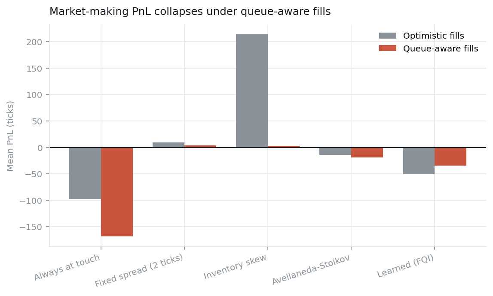
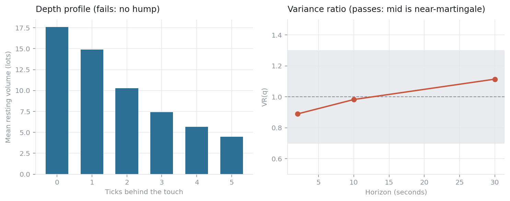
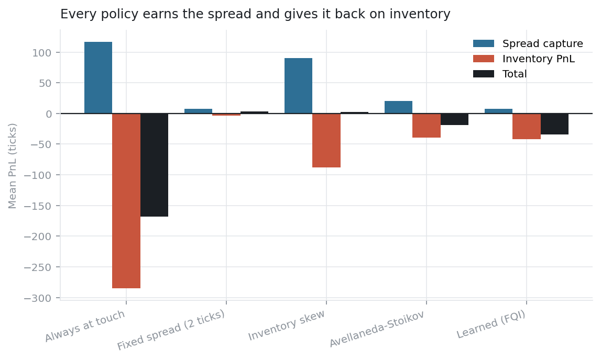
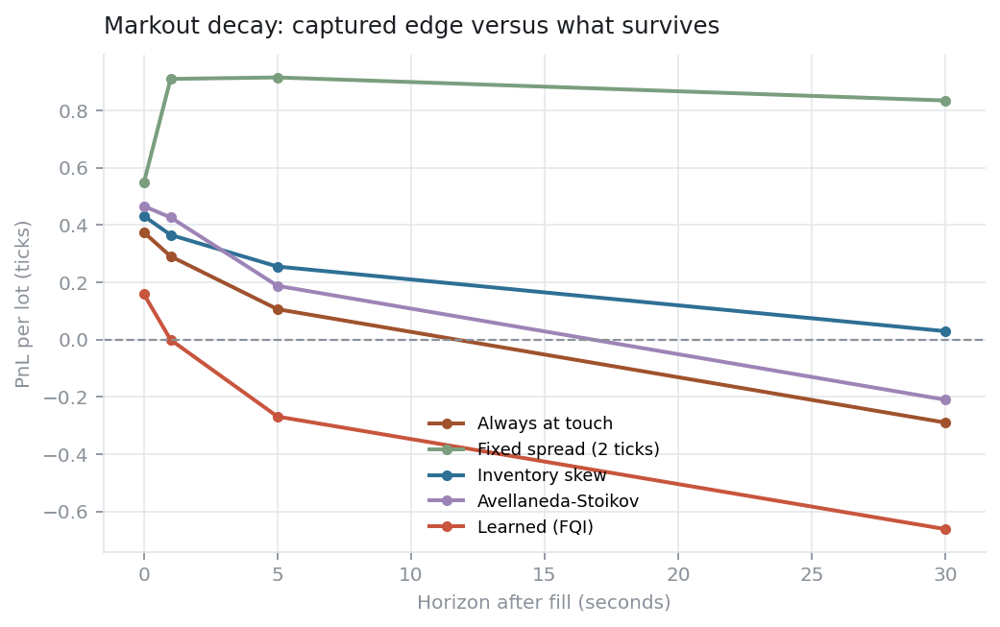
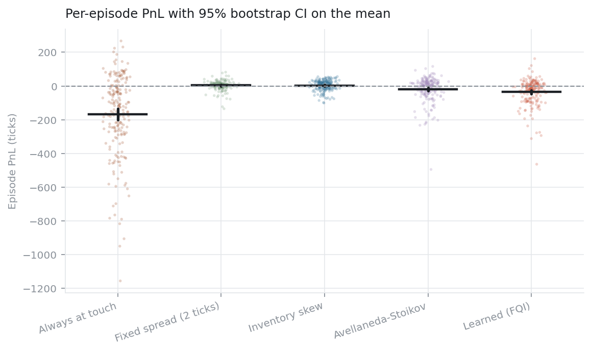
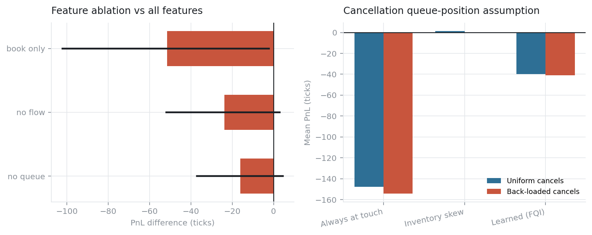

# lobsim — what queue position does to a market-making backtest

[](https://github.com/bradca0/lobsim/actions/workflows/ci.yml)
[](LICENSE)

Almost every market-making backtest fills your resting order when a trade prints at your price.
Real exchanges make you wait in a queue — you trade only after everything ahead of you has traded
or cancelled. This measures what that one assumption is worth.

<!-- BEGIN:claim -->
- **Always at touch**: -98.06 ticks under optimistic fills, -168.13 under queue-aware fills (difference +70.07, 95% CI [+29.47, +109.49]). It executes 2.7x more volume when the queue is ignored.
- **Inventory skew**: +213.87 ticks under optimistic fills, +2.78 under queue-aware fills (difference +211.09, 95% CI [+205.09, +217.21]). It executes 2.9x more volume when the queue is ignored.
- **Learned (FQI)**: -50.28 ticks under optimistic fills, -34.56 under queue-aware fills (difference -15.72, 95% CI [-45.23, +12.66]). It executes 6.8x more volume when the queue is ignored.
<!-- END:claim -->



---

## Results

200 held-out test episodes, queue-aware fills, PnL in ticks per 5-minute episode. "vs baseline" is
the paired difference against inventory-skew, ✓ = significant after Holm–Bonferroni.

<!-- BEGIN:headline -->
| Policy | PnL (ticks) | 95% CI | Fills | Inv. RMS | Edge/lot | 5s markout | vs baseline |
|---|---:|---:|---:|---:|---:|---:|---:|
| Inactive (control) | +0.00 | [+0.00, +0.00] | 0 | 0.0 | — | — | — |
| Always at touch | -168.13 | [-202.43, -134.95] | 249 | 26.9 | +0.374 | +0.106 | -170.91 (✓) |
| Fixed spread, 2 ticks | +3.52 | [-0.24, +7.09] | 9 | 2.6 | +0.548 | +0.915 | +0.74 (n.s.) |
| Inventory skew | +2.78 | [-1.58, +6.95] | 167 | 3.7 | +0.431 | +0.255 | _baseline_ |
| Avellaneda–Stoikov | -18.63 | [-28.80, -9.12] | 33 | 6.8 | +0.466 | +0.188 | -21.41 (✓) |
| **Learned (FQI)** | -34.56 | [-45.43, -24.47] | 34 | 8.0 | +0.159 | -0.268 | -37.34 (✓) |
<!-- END:headline -->

Same policies, both fill models, identical seeds:

<!-- BEGIN:fillmodel -->
| Policy | Optimistic fills | Queue-aware fills | Difference | 95% CI | Fill-volume inflation |
|---|---:|---:|---:|---:|---:|
| Always at touch | -98.06 | -168.13 | +70.07 | [+29.47, +109.49] | 2.72× |
| Fixed spread, 2 ticks | +9.44 | +3.52 | +5.91 | [+1.35, +10.36] | 1.65× |
| Inventory skew | +213.87 | +2.78 | +211.09 | [+205.09, +217.21] | 2.91× |
| Avellaneda–Stoikov | -13.79 | -18.63 | +4.84 | [-9.47, +18.51] | 2.12× |
| **Learned (FQI)** | -50.28 | -34.56 | -15.72 | [-45.23, +12.66] | 6.78× |
<!-- END:fillmodel -->

Inventory-skew is the clean case: a solid earner under optimistic fills is statistically
indistinguishable from zero once the queue is modelled. Nothing about the policy changed.

Two caveats. *Always at touch* loses **more** under queue-aware fills — optimistic filling hands it
extra volume with a healthier markout, while queue-aware filling leaves it holding mainly the trades
that ran it over. And the *learned policy* was trained under queue-aware fills, so its optimistic
column is off-distribution and not a like-for-like read.

Every number here is injected from `results/raw/*.json` by a script. None are hand-typed.

---

## What's built

```
src/lobsim/
  book.py         price-time priority matching engine, exact queue-position tracking
  flow.py         order flow: zero-intelligence + Hawkes + latent fundamental
  engine.py       discrete-event loop, post-only quoting, exact PnL attribution
  features.py     18 microstructure features in 4 ablatable groups
  agents/         5 rule-based baselines + fitted Q-iteration policy
  stats.py        block bootstrap, paired tests, Holm correction, deflated Sharpe
  validation.py   stylized-fact estimators
```

**Engine.** Each price level is an insertion-ordered dict, so the level *is* the FIFO queue:
front-of-queue and mid-queue cancellation are both O(1). Mid-queue cancels are the most common event
in a real book. Agent orders carry a `volume_ahead` counter updated incrementally and cross-checked
against full recomputation by a Hypothesis property test.

Two things it won't let a backtest get away with. **Re-quoting costs queue priority** — changing
your price cancels and rejoins at the back. **Post-only** — a quote that would cross is rejected and
counted, never silently turned aggressive.

**Market.** Zero-intelligence flow + Hawkes market orders + a latent fundamental that aggressive
flow chases. That last part makes flow *informed*, which is what gives the market maker something to
lose. Pure zero-intelligence was built first and rejected on measurement: the mid moved 1–4 ticks
per episode, leaving no inventory risk and no adverse selection ([D3](docs/DECISIONS.md)).

**Policy.** Fitted Q-Iteration over gradient-boosted trees, 16 actions (each side joins the touch,
rests 1–2 ticks back, or pulls). Batch RL — no learning rate, no replay buffer, no divergent runs.

---

## Simulator fidelity

Measured on an **agentless** market so the agent can't flatter it. Targets are bands from the
empirical microstructure literature.

<!-- BEGIN:validation -->
| Stylized fact | Measured | Target band | |
|---|---:|:---:|:--:|
| return excess kurtosis | 30.2230 | [0.5, 50] | pass |
| volatility clustering lag1 | 0.2370 | [0.02, 0.6] | pass |
| volatility clustering lag10 | -0.0068 | [0, 0.4] | **FAIL** |
| raw return acf lag1 | -0.1139 | [-0.35, 0.05] | pass |
| variance ratio 10 | 0.9827 | [0.7, 1.3] | pass |
| variance ratio 30 | 1.1143 | [0.7, 1.3] | pass |
| median spread ticks | 1.0000 | [1, 2] | pass |
| mean touch depth lots | 17.6072 | [5, 60] | pass |
| order size tail index | 1.8726 | [1.4, 3] | pass |
| market order sign acf lag1 | 0.2646 | [0, 0.5] | pass |
| depth profile hump index | 0.0000 | [1, 4] | **FAIL** |

**9 of 11 pass.** Failures are analysed in Limitations.
<!-- END:validation -->



The variance ratio matters most: a mean-reverting mid would pay a market maker for bearing no risk
and make every downstream number an artefact.

---

## Where the money goes



PnL splits into **spread capture** (edge on each fill, marked at execution) and **inventory PnL**
(carrying a position while price moves). The split is an exact identity accumulated one book
mutation at a time; the residual is asserted to be zero across seeds and policies.



Markouts show how much captured edge survives the next few seconds. High spread capture with a
negative markout means you're being picked off.



---

## Ablations

<!-- BEGIN:ablations -->
| Ablation | Variant | PnL (ticks) | Δ vs reference | 95% CI |
|---|---|---:|---:|---:|
| Feature groups | no queue | -55.84 | -16.07 | [-37.09, +4.51] |
| Feature groups | no flow | -63.60 | -23.83 | [-51.96, +2.97] |
| Feature groups | book only | -91.36 | -51.59 | [-102.22, -2.15] |
| Cancel position (at_touch) | back-loaded | -154.38 | -6.63 | [-63.72, +47.17] |
| Cancel position (inventory_skew) | back-loaded | -0.58 | -2.13 | [-9.60, +5.83] |
| Cancel position (fqi) | back-loaded | -40.87 | -1.10 | [-18.92, +17.49] |
| Q estimator | single (vs double) | -36.78 | +2.99 | [-13.80, +20.41] |

Q-value target inflation: 1.85× with the double estimator versus 1.85× with a single one.
<!-- END:ablations -->



Run on the first 100 test seeds (each variant needs its own dataset, fit and evaluation), so these
CIs are wider than the headline's. Seeds are a prefix of the same held-out set, never a re-draw.

Feature ablation point estimates fall monotonically as information is removed — queue −16 ticks,
flow −24, book-only −52 — but only book-only clears significance (p = 0.046). Underpowered at 100
episodes; the ordering is suggestive, not proof.

The double-estimator ablation is a null result: no change in Q-value inflation (1.8519 vs 1.8516),
no PnL change (p = 0.73), despite provably correcting the bias on a synthetic diagnostic. The
inflation metric isn't a clean bias measurement once the discount is doing real work —
[INTERVIEW Q10](docs/INTERVIEW.md).

Cancellation position is the least verifiable assumption in the model and controls how fast the
queue ahead of you evaporates. The default (`UNIFORM`) is the *more generous* of the two, so the
headline isn't manufactured by a pessimistic choice.

---

## Selection-adjusted performance

<!-- BEGIN:deflation -->
| Policy | Sharpe (per episode) | Selection benchmark | Deflated Sharpe | Trials |
|---|---:|---:|---:|---:|
| Fixed spread, 2 ticks | +0.134 | +0.000 | 0.955 | 1 |
| **Learned (FQI)** | -0.459 | +0.140 | 0.000 | 24 |
| Inventory skew | +0.089 | +0.000 | 0.886 | 1 |

The learned policy is deflated by 24 configurations — every FQI variant evaluated on validation seeds across development, not the 4 in the final grid.
<!-- END:deflation -->

---

## Reproduce

Python 3.11+ and [uv](https://docs.astral.sh/uv/). No GPU.

```bash
git clone https://github.com/bradca0/lobsim.git && cd lobsim
make setup
make test            # 263 tests, coverage gate on core logic
make lint typecheck  # ruff + mypy --strict
make reproduce       # regenerates every number and figure above
```

`make reproduce` runs: validation → training (train seeds only, selection on validation seeds) →
backtests on held-out seeds under both fill models → ablations → statistics → figures → README
injection. Raw outputs land in `results/raw/`, each stamped with the git revision that made it.

Budget ~1 hour on an 8 GB M1 Air. Binding constraint is memory, not cores — each worker re-imports
numpy/scipy/sklearn, so workers are capped at 3. Six drove free memory to ~65 MB and stalled the run.

Every episode is fully determined by its seed; parallel and serial paths give identical answers.

<!-- BEGIN:provenance -->
Generated from commit `fe13745` on macOS-26.5.2-arm64-arm-64bit. 200 held-out test episodes (seeds 1000–1199), 60 agentless episodes for validation. Backtests took 5.8 minutes.
<!-- END:provenance -->

---

## Limitations

**The learned policy loses money and loses to a five-line heuristic.** It beats naive
always-at-touch by a wide margin and still loses to `InventorySkew`. Diagnosis is signal-to-noise,
not model capacity: per-step reward has σ ≈ 7 ticks while a good-vs-bad decision is worth a small
fraction of a tick, and FQI has to resolve that from ~120k transitions across 16 actions. Persistent
exploration was worth a large improvement over i.i.d. exploration, so the machinery works — it's the
SNR that doesn't. [INTERVIEW Q15](docs/INTERVIEW.md) lists what I'd try next, in order.

**Synthetic market, calibrated to stylized targets rather than estimated.** Parameters aren't
statistically identified; a different vector reproducing the same book shape would be equally
admissible. Results are conditional on this regime — 1-tick spread, deep queue, where queue position
matters most. The right falsification is real message-level data: replay a genuine book, place
synthetic orders in the real queue, measure the same gap.

**Two stylized facts fail.** Depth profile is monotone decreasing instead of hump-shaped
(re-measured by tick offset to rule out an artefact; unchanged). Volatility clustering dies within
~1s where real markets show slow decay. A two-timescale Hawkes kernel was implemented to fix it,
tested against a pre-registered criterion, failed, and reverted — every setting that produced
clustering collapsed the variance ratio ([D8](docs/DECISIONS.md) has the sweep). Neither failure is
on the causal path from queue mechanics to fill probability.

**No latency, no fees.** Quotes take effect instantly and there are no exchange fees or rebates.
Maker rebates would lift every policy's PnL and change which are profitable — though not the
direction of the fill-model result.

**Single instrument, no hedging.** Inventory is managed only by quoting and terminal liquidation.

---

## Docs

- [DECISIONS.md](docs/DECISIONS.md) — every non-obvious choice, alternatives, and why. Includes the
  ones implemented, measured, and reverted.
- [INTERVIEW.md](docs/INTERVIEW.md) — the 15 hardest questions about this repo, answered with
  pointers into code and results.

MIT licensed.
